# 智能时代的软甲开发环境：进展、挑战与机遇

## 基于大模型的软件自动化——李戈

软件自动化：将从形式的软件功能规格说明到可执行的程序代码这一过程自动化

软件是现实世界的解决方案在计算机系统中的映射。自动化的难点：
- 大型软件复杂程度高
- 研制周期长
- 正确性保证难

大模型的能力范围：模型先验知识 + 训练数据

当前的问题与工作：
软件工程领域的数据分布：开源数据+私人数据
问题：
- 不充分的数据
- 只有代码数据用于学习
- 不能学习数据背后的逻辑
- 破坏了大模型的原始推理能力
- 训练数据和参数量成正比
- 训练上下文和实际应用上下文不一致
- 代码模型 vs 语言模型

这些问题使得在实际环境中很难将大模型应用到软件开发中

工作：
- 要对大模型的使用能力有一个清晰的认知
- 使用大模型的推理能力和IDE的原始能力进行集成
- 促进大模型在软件开发中的应用技术研究

## 智能时代的软件测试——陈振宇

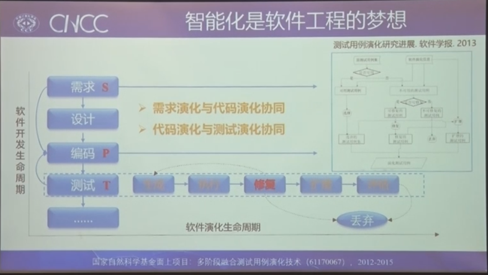

测试数据自动生成

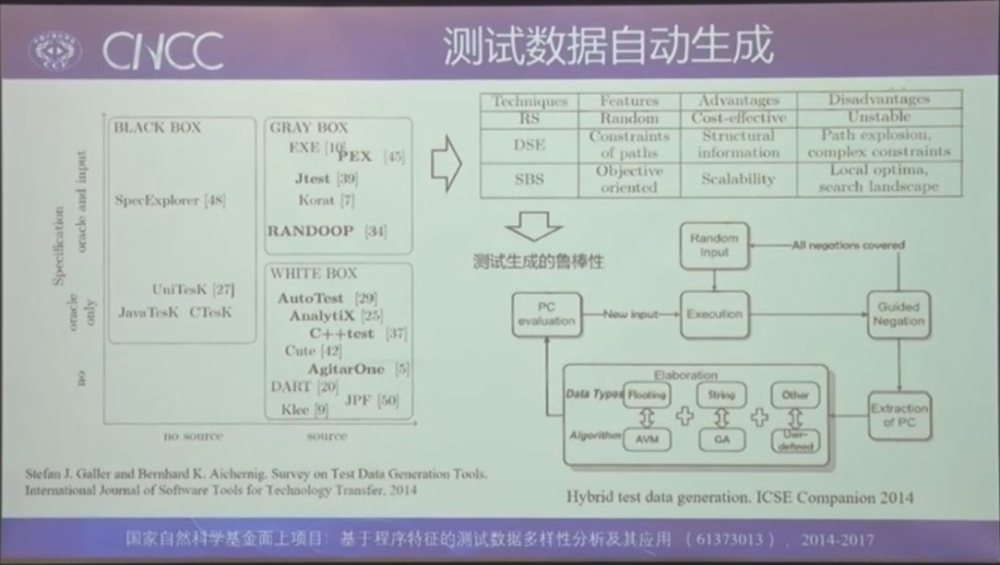

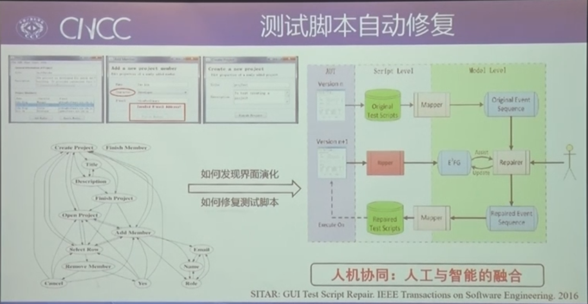

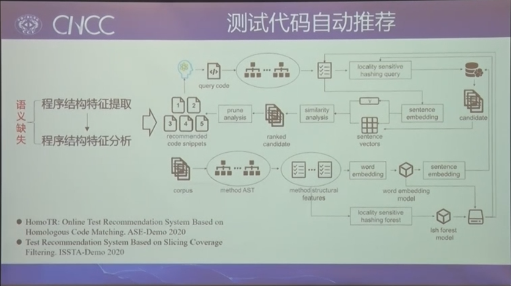

软件工程的大模型代码统计。
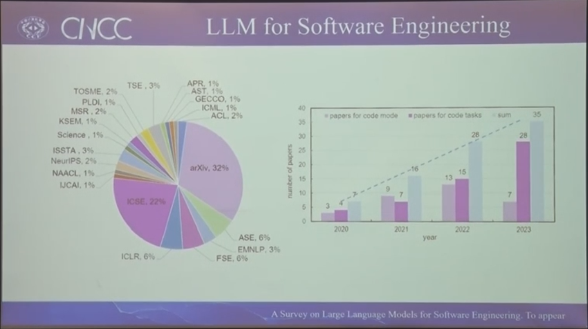

生成测试代码
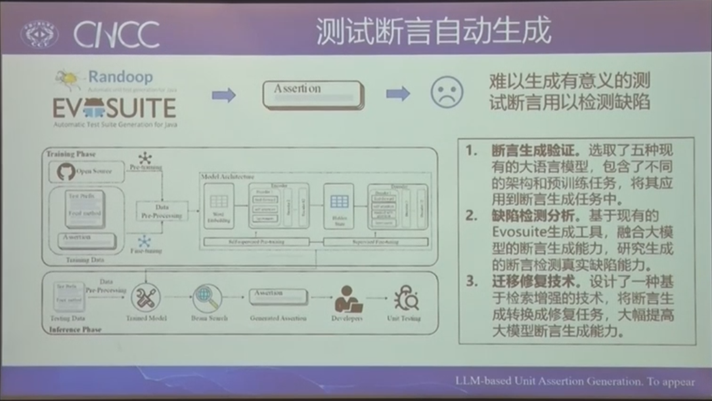

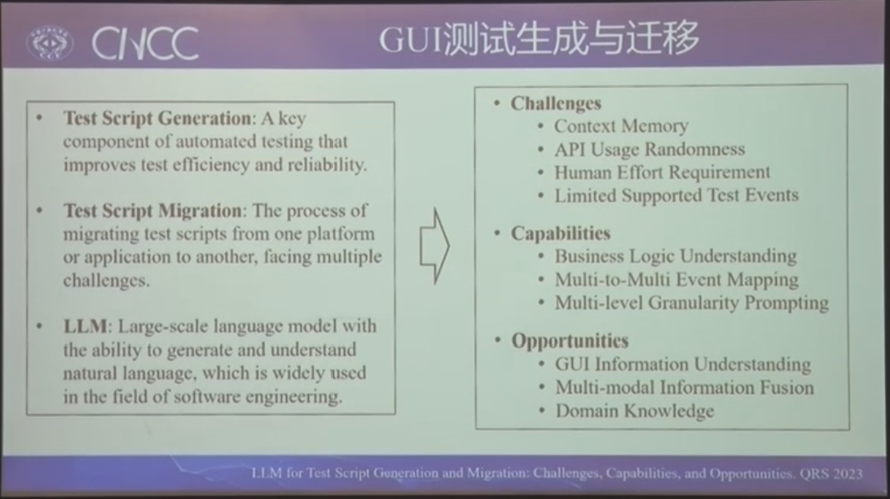

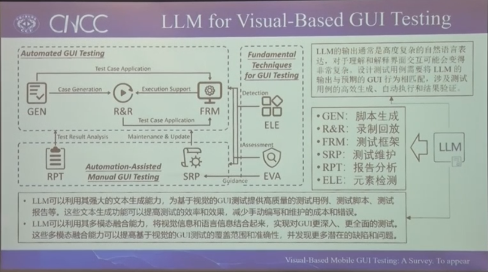

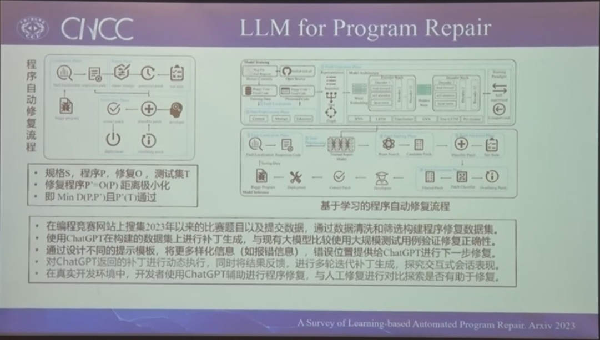

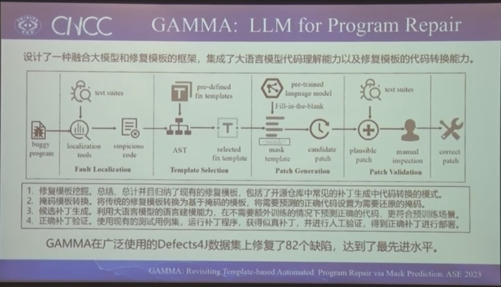

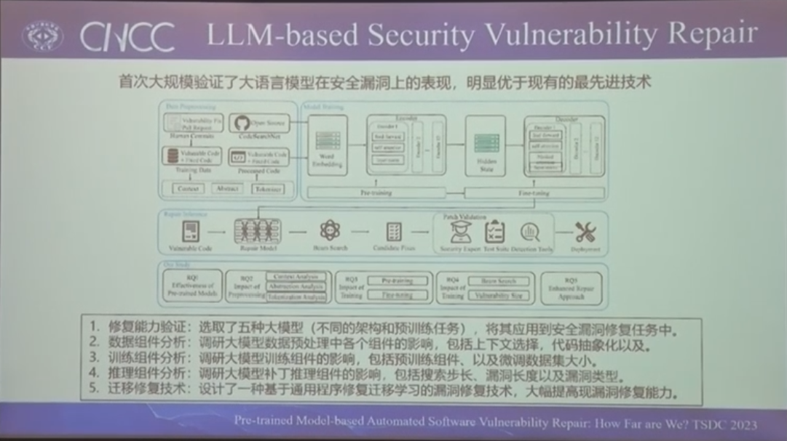

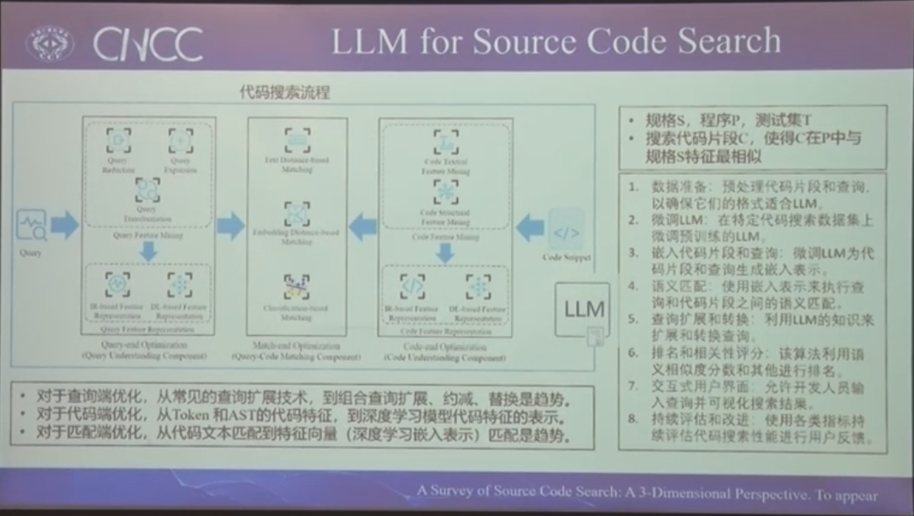

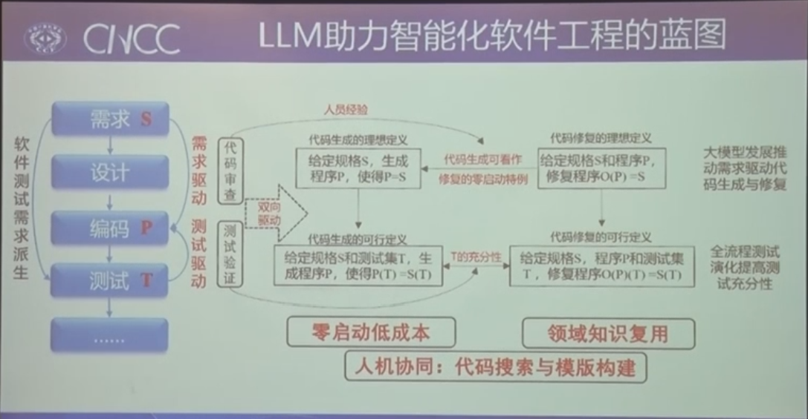

## 基于群智化方法的AI软件构建——孙海龙

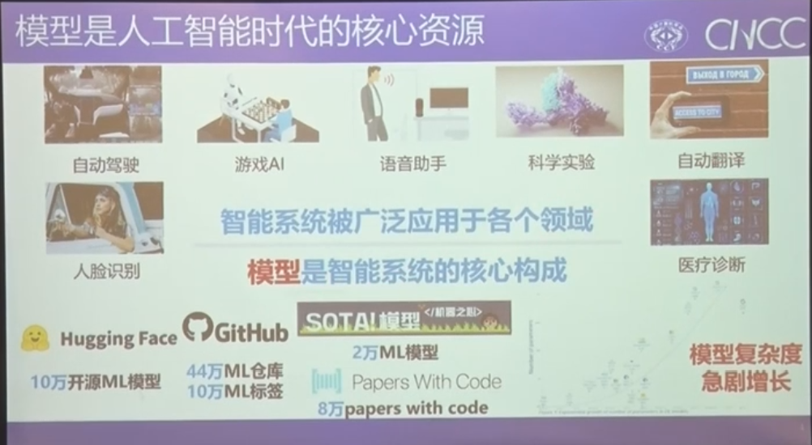

